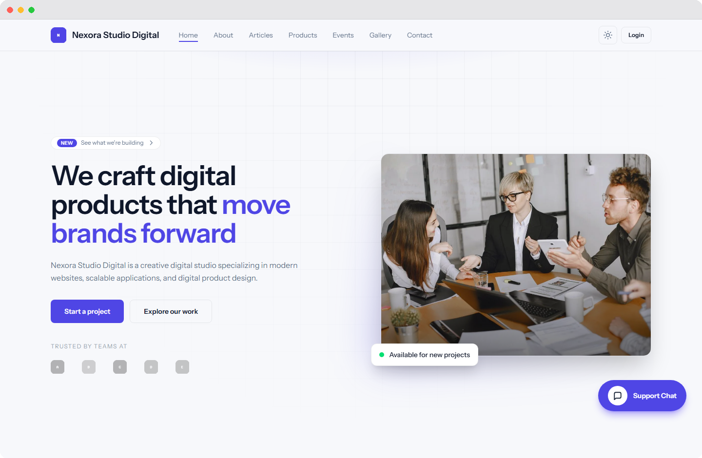
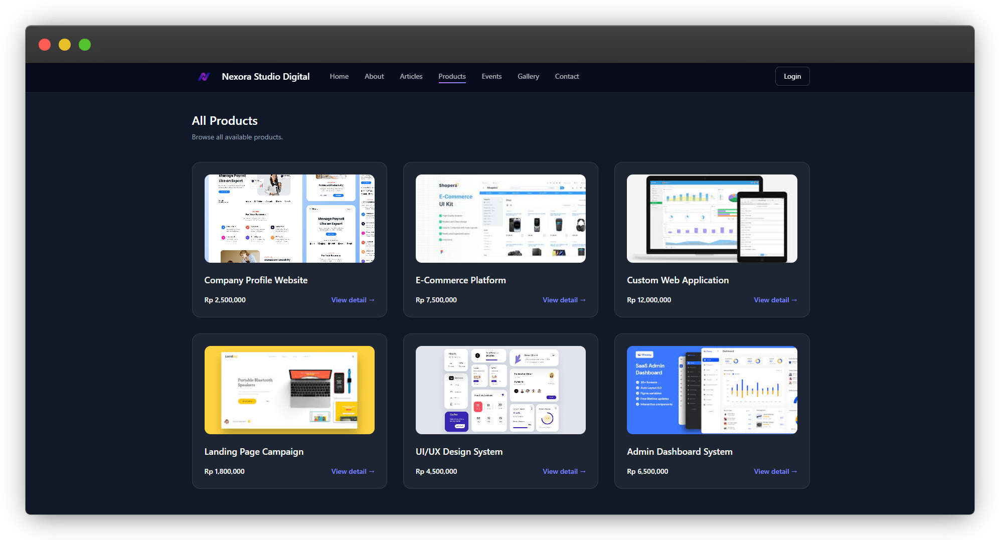
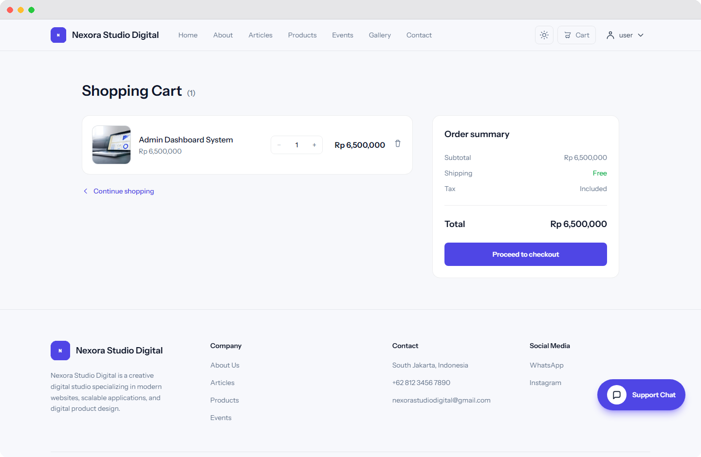
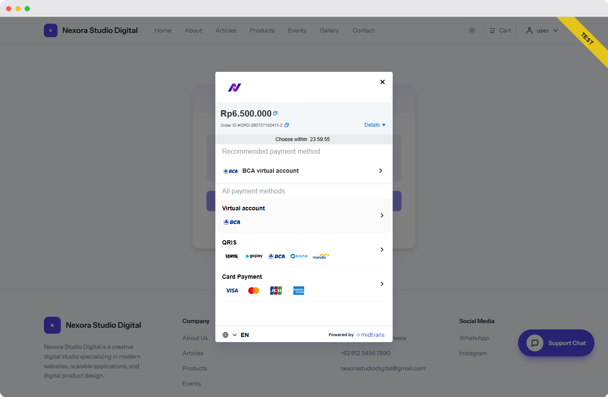
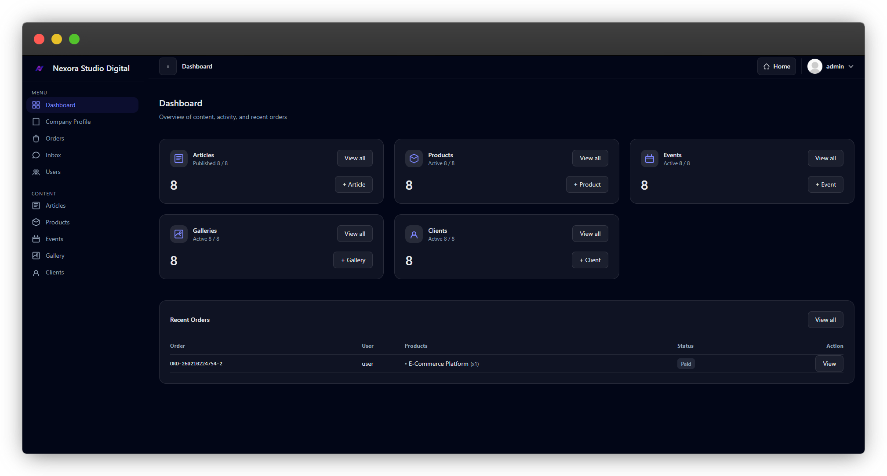

# 🚀 Company Profile & Digital Product Platform (Laravel)

A **full-featured Company Profile & Digital Product Platform** built with **Laravel 12**.

This platform combines a **company profile website** with a **digital product marketplace**, allowing businesses to showcase their services and sell downloadable digital products within a single system.

The application includes:

* Public company profile website
* Digital product marketplace
* Secure checkout with Midtrans payment
* Automatic digital product delivery
* Admin management panel
* User account area
* Contact system powered by EmailJS (no SMTP required)

---

# Screenshots

## Landing Page
<p align="center">
  
</p>

## Purchase Flow

| Product | Cart | Checkout |
|--------|------|----------|
|  |  |  |

<p align="center">
User purchase flow: <b>Product → Cart → Checkout</b>
</p>

## Admin Dashboard
<p align="center">
  
</p>

---

# Table of Contents

* [Project Overview](#project-overview)
* [Main Features](#main-features)
* [Application Areas](#application-areas)
* [Menu and Feature Explanation](#menu-and-feature-explanation)
* [Tech Stack](#tech-stack)
* [Project Structure](#project-structure)
* [Installation Guide](#installation-guide)
* [Frontend Build](#frontend-build)
* [Ngrok Setup](#ngrok-setup)
* [Midtrans Payment Setup](#midtrans-payment-setup)
* [EmailJS Setup](#emailjs-setup)
* [User Flow](#user-flow)
* [Admin Flow](#admin-flow)
* [Security Notes](#security-notes)
* [Documentation Guides](#documentation-guides)

---

# Project Overview

This application combines a **marketing website** and a **transactional digital product platform** into a unified system.

It allows businesses to:

* Present their company profile professionally
* Publish articles and events
* Sell digital products
* Automatically deliver digital downloads after payment
* Manage products and orders through an admin panel

The system follows **Laravel best practices**, using **clean Blade architecture**, modular controllers, and a scalable project structure.

---

# Main Features

| Area           | Features                                    |
| -------------- | ------------------------------------------- |
| Public Website | Company profile, articles, events, products |
| User Area      | Cart, orders, downloads, profile            |
| Admin Panel    | Product management, content management      |
| Payment        | Midtrans Snap integration                   |
| Delivery       | File download or external link              |
| Contact        | EmailJS contact form                        |

---

# Application Areas

The platform consists of **three main areas**.

## Public Website

Accessible without login.

Visitors can:

* View company profile
* Read articles
* Browse events
* Explore digital products
* Contact the company

---

## User Area (Authenticated)

Users access their account after login.

Login page:

```
/login
```

Available features include:

* Cart management
* Checkout
* Order history
* Digital product downloads
* Profile management
* Messaging with admin

Note:

The platform **does not include a traditional dashboard page**.
Users interact with their account through dedicated pages such as **Orders, Cart, and Profile**.

---

## Admin Panel

Admin access:

```
/admin
```

Administrators can manage:

* Products
* Articles
* Events
* Orders
* User messages

Admin routes are protected using authentication and role-based middleware.

---

# Menu and Feature Explanation

## Public Website

Menus available for visitors:

* Home
* About / Vision & Mission
* Articles
* Events
* Products
* Contact

### Contact Form

The contact form uses **EmailJS**, meaning:

* No backend SMTP server required
* Messages are sent from frontend
* Works for both guests and authenticated users

---

## User Area

### Cart

Users can:

* Add products
* Remove products
* Update quantity

---

### Checkout

Checkout creates an order and opens the **Midtrans Snap payment popup**.

---

### Orders

Users can:

* View order history
* Inspect order details
* Download purchased digital products

Downloads are only available after payment confirmation.

---

### Profile

Users can update personal information such as:

* Name
* Email
* Password

---

### Messages

Users can send inquiries to administrators via the messaging system.

---

# Order and Payment System

### Payment Flow

1. User adds product to cart
2. User proceeds to checkout
3. Order is created with status `pending`
4. Midtrans Snap payment popup appears
5. User completes payment
6. Midtrans sends callback to the server
7. Order status updates automatically

---

### Order Status

| Status  | Description         |
| ------- | ------------------- |
| pending | Waiting for payment |
| paid    | Payment successful  |
| expired | Payment timeout     |
| failed  | Payment failed      |

---

# Digital Product Delivery

Products support **two delivery modes**.

## File Delivery

Admin uploads a digital file (ZIP or asset).

Stored in:

```
storage/app/public/templates
```

Users can download the file only after successful payment.

---

## External Link Delivery

Admin provides a URL such as:

* GitHub repository
* Google Drive
* Figma project
* Documentation link

The link becomes visible after payment.

---

# Admin Panel

Admin panel is accessible via:

```
/admin/dashboard
```

---

## Product Management

Admins can:

* Create products
* Edit products
* Delete products
* Upload preview images
* Set price and status
* Choose delivery type

Products can also be manually reordered.

---

## Articles and Events

Admins can publish marketing content including:

* Blog articles
* Event announcements

Routes use **slug-based URLs**.

---

## Order Monitoring

Admins can view and monitor all transactions.

Information available includes:

* Order details
* Payment status
* Midtrans response

---

## Messages

Admins can view and reply to user messages.

---

# Tech Stack

| Layer      | Technology              |
| ---------- | ----------------------- |
| Backend    | Laravel 12              |
| Frontend   | Blade + Tailwind CSS v4 |
| Database   | MySQL                   |
| Payment    | Midtrans Snap           |
| Contact    | EmailJS                 |
| Build Tool | Vite                    |
| Tunnel     | Ngrok                   |
| Storage    | Laravel Filesystem      |

---

# Project Structure

```
app/
├── Http/
│   ├── Controllers/
│   │   ├── Admin/
│   │   ├── Client/
│   │   ├── User/
│   │   └── Auth/
│   └── Middleware/

Models/
├── User.php
├── Product.php
├── Order.php
├── OrderItem.php
├── Cart.php
├── Message.php
├── Article.php
├── Event.php
└── CompanyProfile.php

resources/
├── views/
│   ├── layouts/
│   ├── pages/
│   │   ├── admin/
│   │   ├── client/
│   │   └── user/
│   └── components/

routes/
└── web.php

docs/
├── images/
└── guides/
```

---

# Installation Guide

Clone repository:

```bash
git clone https://github.com/Dimmlul/CompanyProfile-Laravel
cd CompanyProfile-Laravel
```

Install dependencies:

```bash
composer install
npm install
```

Setup environment:

```bash
cp .env.example .env
php artisan key:generate
```

Configure database inside `.env`.

Run migrations:

```bash
php artisan migrate
php artisan db:seed
```

Create storage link:

```bash
php artisan storage:link
```

Run development server:

```bash
php artisan serve
```

---

# Frontend Build

Development:

```bash
npm run dev
```

Production build:

```bash
npm run build
```

---

# Ngrok Setup

Run:

```bash
ngrok http 8000
```

Update `.env`:

```
APP_URL=https://xxxx.ngrok-free.dev
```

---

# Midtrans Payment Setup

Environment variables:

```
MIDTRANS_SERVER_KEY=xxxx
MIDTRANS_CLIENT_KEY=xxxx
MIDTRANS_IS_PRODUCTION=false
```

Callback URL:

```
/midtrans/callback
```

---

# EmailJS Setup

Create account:

https://www.emailjs.com

Create:

* Email Service
* Email Template
* Public Key

Environment variables:

```
EMAILJS_PUBLIC_KEY=xxxx
EMAILJS_SERVICE_ID=xxxx
EMAILJS_TEMPLATE_ID=xxxx
```

---

# User Flow

1. User registers or logs in
2. Browse products
3. Add to cart
4. Checkout
5. Complete payment
6. Order status updated
7. Download product

---

# Admin Flow

1. Login via `/login`
2. System detects admin role
3. Redirect to `/admin`
4. Manage products
5. Monitor orders
6. Reply to user messages

---

# Security Notes

Security measures implemented include:

* CSRF protection
* Authenticated routes
* Role-based admin access
* Order ownership validation
* Protected digital downloads

---

# Documentation Guides

Additional documentation available in the **docs folder**:

- [Authentication Guide](docs/guides/authentication.md)
- [User Guide](docs/guides/user-guide.md)
- [Admin Guide](docs/guides/admin-guide.md)
